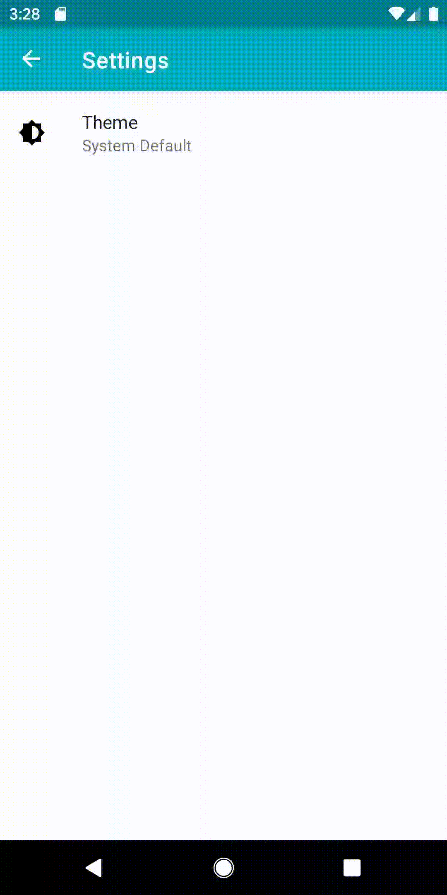

# NightKing

Google I/O 19 Extended ,Nairobi,Kenya, Dark Theme Demo.

This Android App Demonstrate Various Ways of transitioning or creating an app with support for the new rollout of the system
wide dark theme in android Q.

## Prerequisites

Android 9.+ SDK or newer(Required by force dark).

## Guide

Each Branch represents a segment of the presentation ,the steps are highlighted with `TODOS`.
Clone the repo and checkout to a branch to get started.

The master branch provides an implementation using preference settings and 
factors in both devices above and below Q

## Screenshots

|||
|:--:|:--:|

